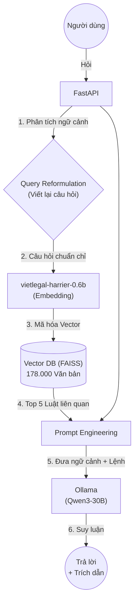

# VKS Legal AI Platform ⚖️

Hệ thống Trí tuệ Nhân tạo (Chatbot Pháp Luật) chuyên sâu dành cho **Viện Kiểm Sát Nhân Dân Việt Nam**, được xây dựng với kiến trúc **Advanced RAG** (Retrieval-Augmented Generation) tiên tiến nhất, đảm bảo tính chính xác tuyệt đối, không bịa đặt (Zero Hallucination).

## 🌟 Tính Năng Nổi Bật

- **Advanced Legal RAG**: Kết hợp mô hình `vietlegal-harrier-0.6b` (chuyên trách pháp luật VN) cùng kho dữ liệu 178.000+ văn bản pháp luật hiện hành.
- **Query Reformulation (Mới)**: AI tự động đọc hiểu toàn bộ lịch sử trò chuyện và **viết lại câu hỏi** (Standalone Question) của người dùng để không bao giờ bị mất ngữ cảnh khi tra cứu luật.
- **GPU-Accelerated Indexing**: Cung cấp script độc lập (`build_index.py`) để tận dụng 100% sức mạnh card rời (RTX 3090/4090/5090) nhúng toàn bộ kho dữ liệu khổng lồ chỉ trong 15-30 phút.
- **Qwen3-30B-A3B**: Mô hình ngôn ngữ lớn (LLM) chạy hoàn toàn Local/On-Premise (không qua API bên thứ ba) giúp bảo mật tuyệt đối dữ liệu nghiệp vụ của ngành kiểm sát.
- **Trích dẫn minh bạch**: Tự động trả về chính xác Điều/Khoản luật đã dùng để suy luận.
- **Zero-Login Public Access**: Cung cấp link Cloudflare public để truy cập nhanh mà không cần tạo tài khoản (hệ thống cấp API-Key ẩn danh tự động).

---

## 🏗️ Kiến Trúc Hệ Thống (Advanced RAG Flow)

Hệ thống hoạt động như một "kiểm sát viên/luật sư" thực thụ qua 4 bước khép kín:



1. **Nhận diện ngữ cảnh**: Nếu người dùng hỏi câu cụt lủn (VD: *"Nếu vô ý thì sao?"*), hệ thống dùng Qwen3 đọc các câu trước đó và tự dịch thành *"Hình phạt tội vô ý giết người?"*.
2. **Mã hóa (Embedding)**: Chuyển câu hỏi thành Vector 1024 chiều.
3. **Tra cứu (Retrieval)**: Quét trong kho 178 ngàn văn bản luật để móc ra 5 đoạn luật sát nghĩa nhất.
4. **Suy luận (Generation)**: Ép Qwen3 **chỉ được phép** dùng 5 đoạn luật đó để trả lời người dùng, tuyệt đối không chém gió.

---

## 🚀 Hướng Dẫn Cài Đặt & Chạy Hệ Thống

Dự án được tối ưu để chạy trên **Vast.ai** (Ubuntu) với GPU NVIDIA (RTX 3090/4090/5090).

### Bước 1: Khởi tạo dữ liệu Vector (Chạy Native bằng GPU)
Thay vì nạp dữ liệu chậm chạp trong Docker, hệ thống tách riêng bước này để chạy thẳng bằng sức mạnh GPU của máy chủ:

```bash
git pull origin main
source venv/bin/activate
pip install pandas fastparquet requests

# Chạy lệnh nạp dữ liệu (Nạp toàn bộ 178k văn bản)
# Thư mục vector_store cũ sẽ tự động được xóa trước khi nạp
python build_index.py
```
*(Chờ khoảng 15 - 30 phút để nạp hoàn tất toàn bộ dữ liệu pháp luật Việt Nam).*

### Bước 2: Khởi động hệ thống (Bằng Docker & Native)
Do Vast.ai đôi khi không cài sẵn gói `nvidia-container-toolkit`, hệ thống áp dụng chiến lược Hybrid:
- **MongoDB**: Chạy bằng Docker.
- **FastAPI Backend**: Chạy trực tiếp trên máy chủ ảo (Native) để hứng 100% sức mạnh GPU lúc trả lời chat.

```bash
# 1. Bật Database
docker compose up -d mongodb

# 2. Bật API Backend ngầm (Xóa log cũ để nhẹ máy)
> /var/log/vks-api.log
nohup python -m uvicorn backend.main:app --host 0.0.0.0 --port 8000 &>/var/log/vks-api.log &

# 3. Mở Public Link bằng Cloudflare Tunnel
killall cloudflared 2>/dev/null
nohup cloudflared tunnel --url http://localhost:8000 > /var/log/cloudflared.log 2>&1 &
```

### Bước 3: Lấy Link Truy Cập
Chỉ cần chờ 3 giây và chạy lệnh sau để lấy link sử dụng:
```bash
grep -o 'https://.*\.trycloudflare.com' /var/log/cloudflared.log
```
Gửi link này cho sếp hoặc đồng nghiệp, họ có thể vào chat trực tiếp ngay trên điện thoại hoặc máy tính.

---

## 🛠 Tech Stack

| Component | Technology | Role |
|---|---|---|
| **LLM Engine** | Qwen3-30B-A3B / Ollama | Suy luận ngôn ngữ, diễn đạt văn bản luật |
| **Embedding** | mainguyen9/vietlegal-harrier-0.6b | Chuyển đổi ngữ nghĩa tiếng Việt sang Vector |
| **Database** | FAISS (Meta) | Lưu trữ Vector, tìm kiếm mili-giây |
| **Backend** | FastAPI + Motor | API Server, Quản lý luồng RAG bất đồng bộ |
| **Storage** | MongoDB | Lưu trữ phiên chat, API Keys, System logs |
| **Dataset** | `th1nhng0/vietnamese-legal-documents` | Gồm ~178.600 văn bản pháp quy từ trước tới nay |
