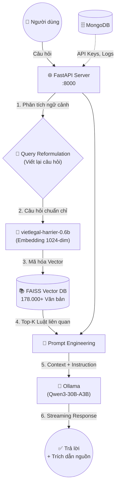

# VKS Legal AI Platform ⚖️🤖

<p align="center">
  <strong>Hệ thống Trí tuệ Nhân tạo Pháp Luật dành cho Viện Kiểm Sát Nhân Dân Việt Nam</strong><br/>
  <em>Advanced RAG · Qwen3-30B · 178.000+ Văn bản Pháp quy · 100% Local/On-Premise</em>
</p>

<p align="center">
  
  
  
  
  
  
</p>

---

## 📑 Mục Lục

- [Giới Thiệu](#-giới-thiệu)
- [Kiến Trúc Hệ Thống](#-kiến-trúc-hệ-thống)
- [Tính Năng Nổi Bật](#-tính-năng-nổi-bật)
- [Tech Stack](#-tech-stack)
- [Cài Đặt & Chạy](#-cài-đặt--chạy)
- [API Reference (Tổng Quan)](#-api-reference-tổng-quan)
- [Tài Liệu Chi Tiết](#-tài-liệu-chi-tiết)
- [Đóng Góp](#-đóng-góp)
- [License](#-license)

---

## 🌟 Giới Thiệu

**VKS Legal AI** là chatbot pháp luật chuyên sâu, được xây dựng với kiến trúc **Advanced RAG** (Retrieval-Augmented Generation) tiên tiến nhất, đảm bảo:

- 🎯 **Tính chính xác tuyệt đối** — Trích dẫn đúng Điều/Khoản luật, không bịa đặt (Zero Hallucination)
- 🔒 **Bảo mật tối đa** — Chạy hoàn toàn On-Premise, không gửi dữ liệu ra bên ngoài
- ⚡ **Phản hồi nhanh** — GPU-accelerated search + streaming response
- 🔗 **OpenAI-Compatible API** — Tích hợp dễ dàng với bất kỳ ứng dụng nào

---

## 🏗 Kiến Trúc Hệ Thống



**Luồng hoạt động:**

1. **Query Reformulation** — Nếu câu hỏi mơ hồ (VD: *"Nếu vô ý thì sao?"*), AI đọc lịch sử hội thoại và viết lại thành câu hỏi đầy đủ (*"Hình phạt cho tội vô ý giết người theo BLHS?"*)
2. **Embedding** — Chuyển câu hỏi thành vector 1024 chiều bằng model chuyên pháp luật VN
3. **Retrieval** — Tìm Top-5 đoạn luật liên quan nhất trong kho 178.000+ văn bản
4. **Generation** — Qwen3-30B suy luận **chỉ dựa trên** các đoạn luật đã truy xuất, kèm trích dẫn nguồn

---

## ✨ Tính Năng Nổi Bật

| Tính Năng | Mô Tả |
|---|---|
| 🔍 **Advanced Legal RAG** | Kết hợp `vietlegal-harrier-0.6b` + FAISS + 178K văn bản pháp quy |
| 🔄 **Query Reformulation** | Tự động viết lại câu hỏi theo ngữ cảnh hội thoại |
| ⚡ **Streaming Response** | Phản hồi real-time qua Server-Sent Events (SSE) |
| 🔐 **API Key Authentication** | Hệ thống quản lý API Key với rate limiting |
| 📊 **Admin Dashboard** | Theo dõi usage, quản lý RAG, health monitoring |
| 🔀 **Dual Mode** | Chế độ Legal RAG + General AI (chat tự do) |
| 🐳 **Docker Ready** | One-command deployment với Docker Compose |
| ☁️ **Cloud GPU** | Script tự động setup trên Vast.ai / RunPod |

---

## 🛠 Tech Stack

| Component | Technology | Vai trò |
|---|---|---|
| **LLM Engine** | Qwen3-30B-A3B / Ollama | Suy luận ngôn ngữ, sinh văn bản |
| **Embedding** | `mainguyen9/vietlegal-harrier-0.6b` | Chuyển ngữ nghĩa tiếng Việt → Vector 1024-dim |
| **Vector DB** | FAISS (Meta) | Lưu trữ vector, tìm kiếm < 10ms |
| **Backend** | FastAPI + Uvicorn | API Server bất đồng bộ |
| **Database** | MongoDB 7.0 + Motor | API Keys, usage logs, conversations |
| **Auth** | JWT + SHA-256 API Keys | Authentication & authorization |
| **Dataset** | `th1nhng0/vietnamese-legal-documents` | 178.600+ văn bản pháp quy VN |
| **Deployment** | Docker Compose + Cloudflare Tunnel | Container orchestration + public access |

---

## 🚀 Cài Đặt & Chạy

### Yêu Cầu Hệ Thống

- **OS**: Ubuntu 22.04+ / Windows 10+ / macOS
- **GPU**: NVIDIA RTX 3090/4090/5090 (khuyến nghị ≥ 24GB VRAM)
- **RAM**: ≥ 32GB
- **Storage**: ≥ 50GB free
- **Software**: Python 3.11+, Docker, Ollama

### Cài Đặt Nhanh (Cloud GPU — Vast.ai)

```bash
# 1. Clone repo
git clone https://github.com/phamkhoa18/Qwen_model_local.git
cd Qwen_model_local

# 2. Chạy script tự động (cài MongoDB, Ollama, pull model, setup Python)
chmod +x setup_cloud.sh
./setup_cloud.sh

# 3. Khởi động
./start.sh
```

### Cài Đặt Thủ Công (Local)

```bash
# 1. Clone repo
git clone https://github.com/phamkhoa18/Qwen_model_local.git
cd Qwen_model_local

# 2. Cài đặt dependencies
python -m venv venv
source venv/bin/activate        # Linux/macOS
# venv\Scripts\activate         # Windows
pip install -r requirements.txt

# 3. Cài đặt Ollama + pull model
curl -fsSL https://ollama.com/install.sh | sh
ollama pull qwen3:30b-a3b

# 4. Cấu hình môi trường
cp .env.example .env
# Chỉnh sửa .env theo cần thiết

# 5. Khởi động MongoDB (Docker)
docker compose up -d mongodb

# 6. Nạp dữ liệu pháp luật (chạy bằng GPU)
python build_index.py

# 7. Khởi động API server
python -m uvicorn backend.main:app --host 0.0.0.0 --port 8000
```

### Cấu Hình Môi Trường (`.env`)

```env
# Application
APP_NAME=VKS Legal AI
APP_VERSION=2.0.0
DEBUG=false
SECRET_KEY=your-secret-key-here

# Server
HOST=0.0.0.0
PORT=8000

# MongoDB
MONGODB_URI=mongodb://localhost:27017
MONGODB_DB=vks_legal_ai

# Ollama LLM
OLLAMA_BASE_URL=http://localhost:11434
DEFAULT_MODEL=qwen3:30b-a3b

# RAG Settings
EMBEDDING_MODEL=mainguyen9/vietlegal-harrier-0.6b
VECTOR_STORE_PATH=./data/vector_store
TOP_K=5
SIMILARITY_THRESHOLD=0.35

# Admin
ADMIN_USERNAME=admin
ADMIN_PASSWORD=change-this-password

# Rate Limiting
RATE_LIMIT_PER_MINUTE=30
```

---

## 📖 API Reference (Tổng Quan)

> 📄 **Xem tài liệu API đầy đủ tại:** [`docs/API_REFERENCE.md`](docs/API_REFERENCE.md)

API tương thích chuẩn **OpenAI Chat Completions**, giúp tích hợp dễ dàng với các SDK/thư viện có sẵn.

### Base URL

```
http://your-server:8000
```

### Authentication

Tất cả API endpoints yêu cầu API Key qua header:

```
Authorization: Bearer vks-xxxxxxxxxxxx
```

### Endpoints Chính

| Method | Endpoint | Mô tả |
|--------|----------|--------|
| `POST` | `/v1/chat/completions` | Chat completion (RAG + Streaming) |
| `POST` | `/v1/documents/search` | Tìm kiếm văn bản pháp luật |
| `GET`  | `/v1/models` | Liệt kê models khả dụng |
| `POST` | `/admin/login` | Đăng nhập admin |
| `GET`  | `/admin/health` | Kiểm tra trạng thái hệ thống |
| `GET`  | `/admin/usage` | Thống kê sử dụng |
| `POST` | `/admin/api-keys` | Tạo API key mới |
| `GET`  | `/admin/api-keys` | Liệt kê API keys |
| `DELETE` | `/admin/api-keys/{id}` | Thu hồi API key |
| `POST` | `/admin/rag/index` | Bắt đầu index dataset |
| `GET`  | `/admin/rag/status` | Trạng thái RAG index |
| `POST` | `/admin/rag/add-document` | Thêm tài liệu tùy chỉnh |
| `POST` | `/admin/rag/clear` | Xóa toàn bộ index |

### Quick Example

```bash
curl -X POST http://localhost:8000/v1/chat/completions \
  -H "Authorization: Bearer vks-your-api-key" \
  -H "Content-Type: application/json" \
  -d '{
    "model": "qwen3:30b-a3b",
    "messages": [{"role": "user", "content": "Tội trộm cắp tài sản bị xử phạt thế nào?"}],
    "use_rag": true,
    "stream": false
  }'
```

---

## 📚 Tài Liệu Chi Tiết

| Tài liệu | Nội dung |
|-----------|----------|
| [📖 API Reference](docs/API_REFERENCE.md) | Chi tiết từng endpoint, request/response, code examples |
| [🔗 Integration Guide](docs/INTEGRATION_GUIDE.md) | Hướng dẫn tích hợp Python, JavaScript, cURL, OpenAI SDK |
| [🚀 Deployment Guide](docs/DEPLOYMENT.md) | Deploy trên Docker, Vast.ai, VPS, production checklist |

---

## 🤝 Đóng Góp

1. Fork repo
2. Tạo branch mới (`git checkout -b feature/ten-tinh-nang`)
3. Commit thay đổi (`git commit -m 'Thêm tính năng XYZ'`)
4. Push lên branch (`git push origin feature/ten-tinh-nang`)
5. Tạo Pull Request

---

## 📝 License

Dự án được phát hành theo giấy phép **MIT**. Xem file [LICENSE](LICENSE) để biết thêm chi tiết.

---

<p align="center">
  <strong>Developed by Pham Khoa</strong> · <em>Viện Kiểm Sát Nhân Dân Việt Nam</em><br/>
  ⚖️ Công lý · Chính xác · Minh bạch
</p>
